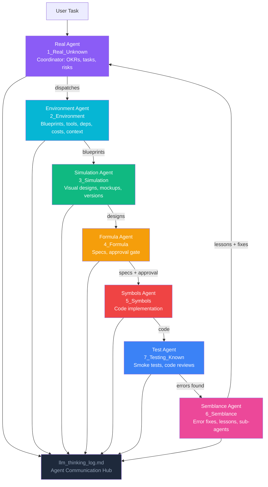

# video-asistant

> https://rifaterdemsahin.github.io/video-asistant/index.html

My video production assistant — an AI-guided project built on the [delivery-pilot-template](https://github.com/rifaterdemsahin/delivery-pilot-template) 7-stage framework, with each stage owning part of the workflow and communicating through a shared thinking log.

## Project Goal

| | |
|---|---|
| **Objective** | Be my video production assistant |
| **Key Result** | Help me with my video production tasks |
| **Environment** | Chrome, AI models |
| **Sources** | Markdown files |

See [`1_Real_Unknown/problem_statement.md`](1_Real_Unknown/problem_statement.md) and [`1_Real_Unknown/okrs.md`](1_Real_Unknown/okrs.md) for the full breakdown.

## Agentic Workflow

**How the agents communicate**: All 7 agents write their reasoning to `4_Formula/llm_thinking_log.md`. Upstream agents log their decisions; downstream agents read those logs before acting. The Semblance Agent closes the loop by feeding resolved errors and lessons back to the Real Agent.

## 🧠 Cognitive Mapping — 7 Stages

| Stage | Folder | Cognitive Step | Agent |
|-------|--------|---------------|-------|
| 1 | `1_Real_Unknown` | **Active Ignorance** — State what you don't know | Real Agent |
| 2 | `2_Environment` | **Mental Sandbox** — Build context and constraints | Environment Agent |
| 3 | `3_Simulation` | **Visualization** — Make the invisible visible | Simulation Agent |
| 4 | `4_Formula` | **Synthesis** — Plan, spec, and decide | Formula Agent |
| 5 | `5_Symbols` | **Execution** — Turn plans into reality | Symbols Agent |
| 7 | `7_Testing_Known` | **Validation** — Prove it works | Test Agent |
| 6 | `6_Semblance` | **Feedback Loop** — Learn from errors, improve | Semblance Agent |

## Secrets

Secrets live in the existing Azure Key Vault `dp-kv-deliverypilot` — see [`2_Environment/setup_azure.md`](2_Environment/setup_azure.md) and [`.kilo/skills/secrets.md`](.kilo/skills/secrets.md). No new vault is created for this project.

## How to use

1. Read `agents.md` for agent coordination rules
2. Read `1_Real_Unknown/prompts.md` for the project management framework
3. Start with `1_Real_Unknown/` — the problem statement and OKRs are already defined
4. Let AI agents guide you through each stage

## Links

- **GitHub Pages:** [https://rifaterdemsahin.github.io/video-asistant/](https://rifaterdemsahin.github.io/video-asistant/)
- **GitHub:** [video-asistant](https://github.com/rifaterdemsahin/video-asistant)
- **Template:** [delivery-pilot-template](https://github.com/rifaterdemsahin/delivery-pilot-template)
- **LinkedIn:** [rifaterdemsahin](https://www.linkedin.com/in/rifaterdemsahin/)
- **YouTube:** [@RifatErdemSahin](https://www.youtube.com/@RifatErdemSahin)
